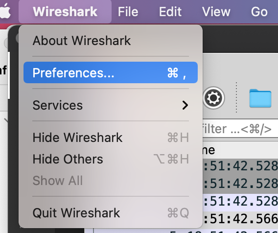
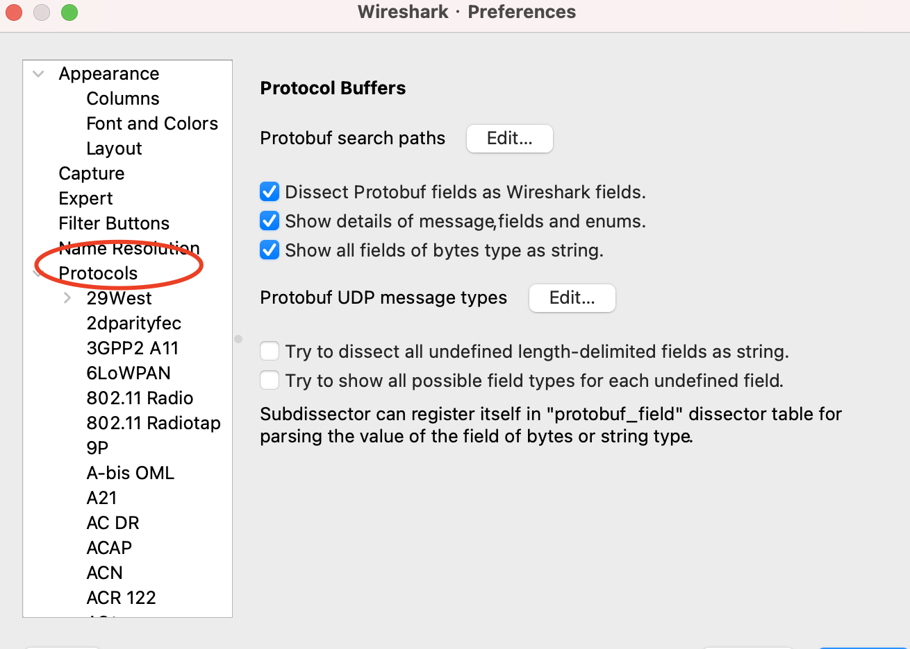
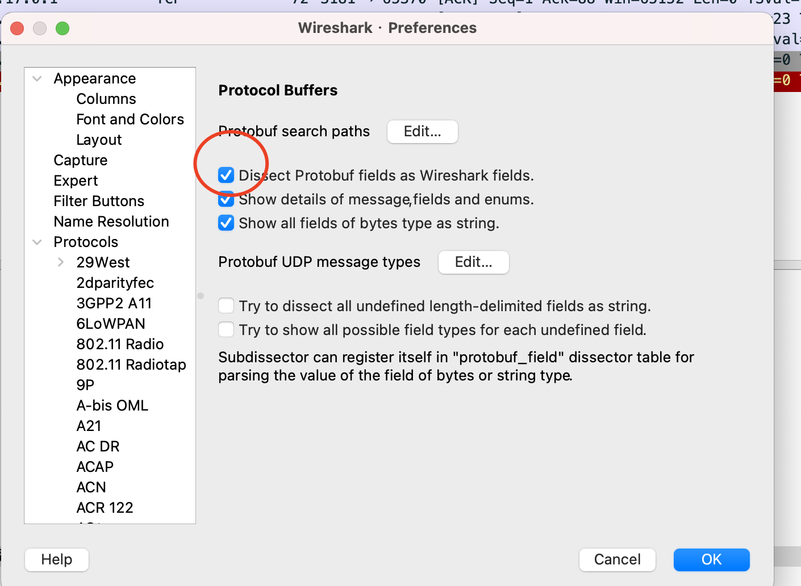

# pulsar&bookkeeper
## step1 proto文件导入Wireshark
### 打开wireshark preference
- 
### 选中wireshark protocol
- 
### 修改Protocol Buffer的搜索路径
修改ProtoBuf的搜索路径，并勾选Loadall
## step2 如果需要在wireshark上搜索过滤protobuf字段
再次打开Wireshark中的protobuf配置，勾选`Dissect Protobuf fields as Wireshark fields`选项
- 
#### step3 执行脚本，将lua放入到wireshark的插件目录
```bash
bash scripts/mac/deploy.sh
```
#### step4 重启或热加载Wireshark
热加载Wireshark插件: Command + Shift + L